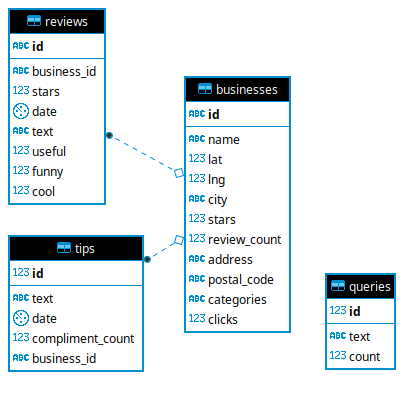

# Preparation

This document describes the first steps before moving up with lucene.


## Creating a database

In order to keep data in a more structured format I'm going to create a database and then import them. That way it will
be easier to work with them in lucene later.

I'm going to use Postgres as a DBMS, the schema is really simple and it is presented below.




## Importing data

At this point we need to import yelp's JSON datasets into our database. In order to do that we'll first convert them
into tsv respectively to the table and column names we created above.

### Converting to TSV

For converting from JSON to TSV I'm going to use a command line tool called `jq`

```bash
# example usage of `jq` for exporting to tsv
jq -r '[.business_id, .name, .latitude] | @tsv' \
    business.json                               \
    | tr "\"" "'"                               \
    > businesses.tsv
```

### Importing TSV

Now I'm going to import the 3 TSV datasets into my database. I used the official postgres GUI `pgAdmin 4`
for the importing process but it's also pretty straightforward using raw SQL.

```sql
-- Example command for importing a TSV file
COPY businesses FROM '/path/to/businesses.tsv' DELIMITER '\t'
```
